# Retos — Plataforma Educativa para Formación Profesional

> Proyecto de prácticas · 2º DAM (Desarrollo de Aplicaciones Multiplataforma) · DuaLab

---

## Índice

1. [¿Qué es Retos?](#qué-es-retos)
2. [Capturas de pantalla](#capturas-de-pantalla)
3. [Contexto del proyecto](#contexto-del-proyecto)
4. [Objetivos](#objetivos)
5. [Stack tecnológico](#stack-tecnológico)
6. [Arquitectura](#arquitectura)
7. [Flujo de la aplicación](#flujo-de-la-aplicación)
8. [Funcionalidades principales](#funcionalidades-principales)
9. [Diseño UX/UI](#diseño-uxui)
10. [Proceso de implementación](#proceso-de-implementación)
11. [Lo que aprendí](#lo-que-aprendí)

---

## ¿Qué es Retos?

**Retos** es una plataforma web educativa que conecta centros de Formación Profesional, empresas del sector y docentes en torno a desafíos pedagógicos reales.

La idea es sencilla pero potente: las empresas plantean un problema del día a día, y ese problema se convierte en un **reto** que los alumnos resuelven como proyecto. Un puente directo entre aula y mercado laboral.

La plataforma cubre todo el ciclo:

- Generación de retos (con asistencia de IA)
- Biblioteca de retos filtrable
- Creación de proyectos asignados a grupos de alumnos
- Validación del proyecto por la empresa
- Registro de sesiones y seguimiento docente
- CRM de gestión de empresas colaboradoras

---

## Capturas de pantalla

> Las capturas se guardan en [`docs/capturas/`](docs/capturas/CAPTURAS.md). Añade el archivo con el nombre indicado y aparecerá aquí automáticamente.

### Landing y login
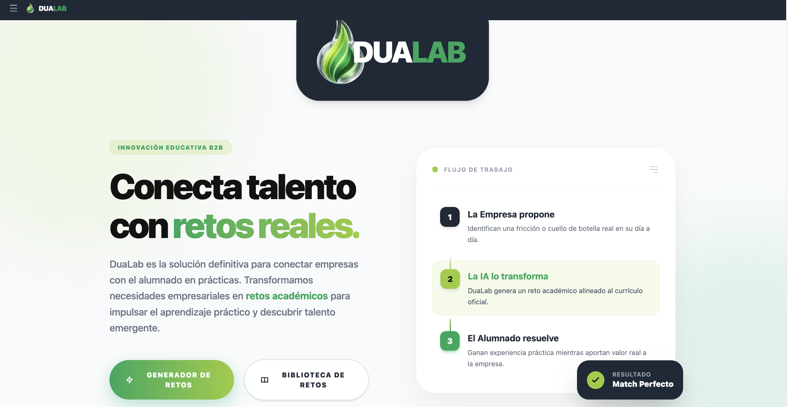

### Generador de Retos
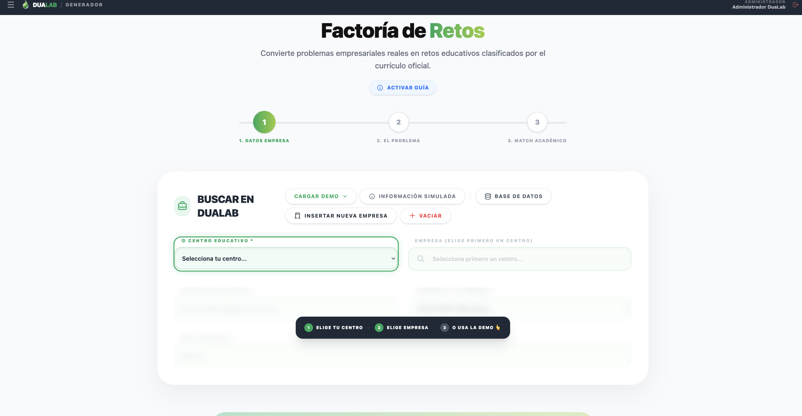

### Diagnóstico Empresarial y Asistente IA
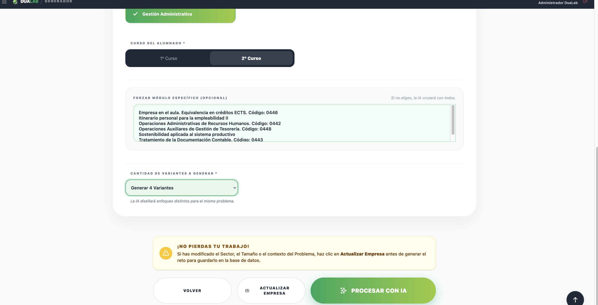
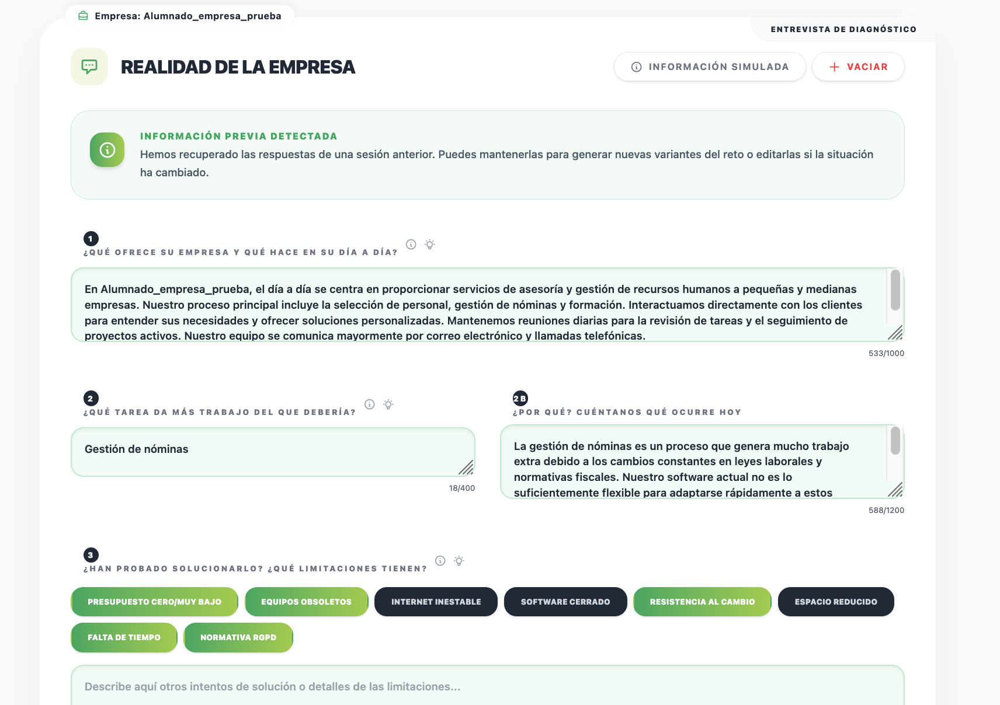

### Biblioteca con filtros
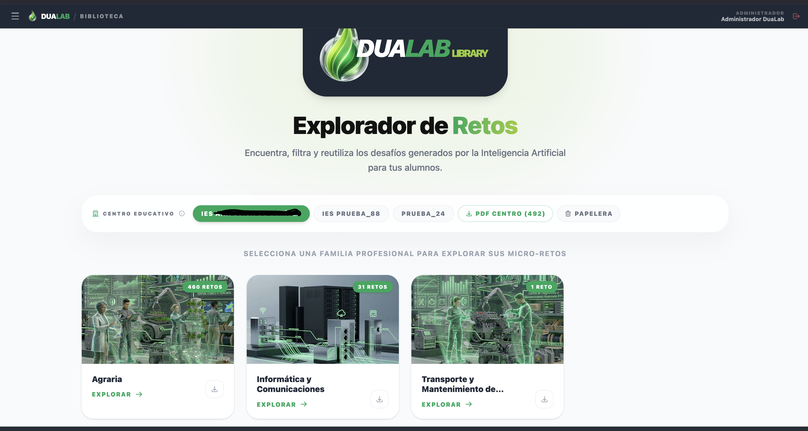
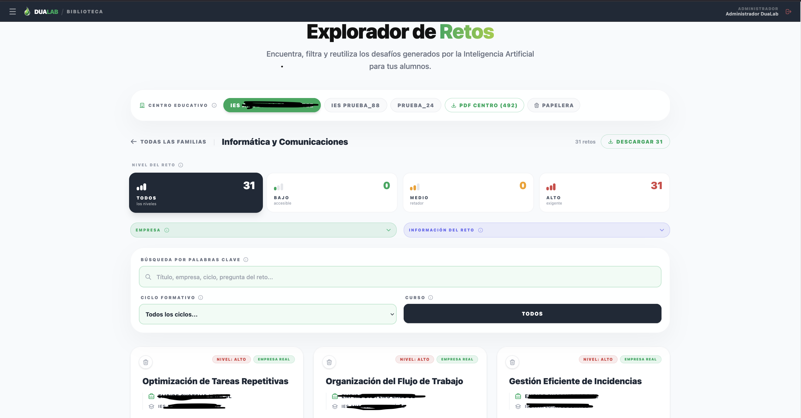

### Detalle de reto
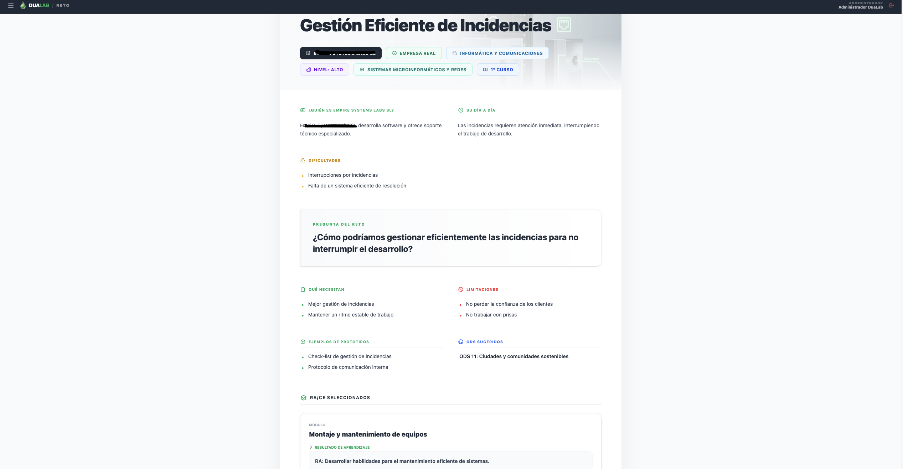

### Sesiones en Dashboard Docente (Taller de Ideas)
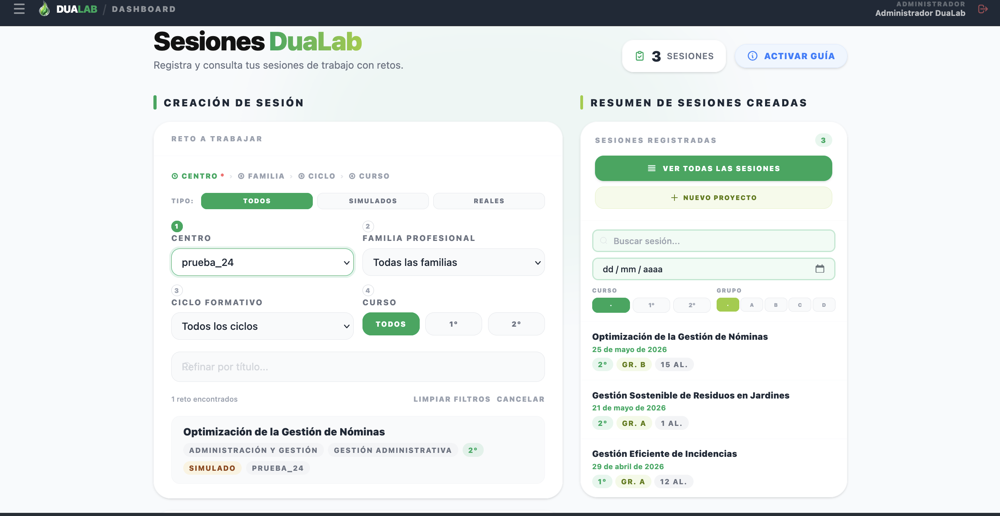
### Wizard de Proyecto (Taller de Ideas)
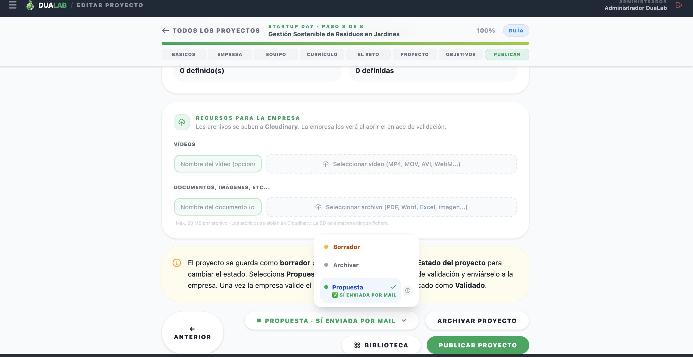

### Para la validación (empresa)
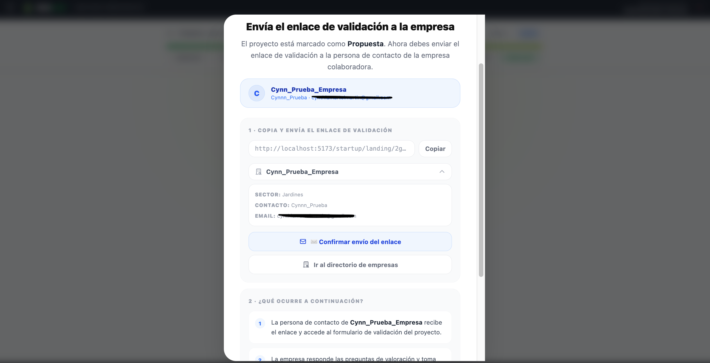

### CRM – Directorio de empresas
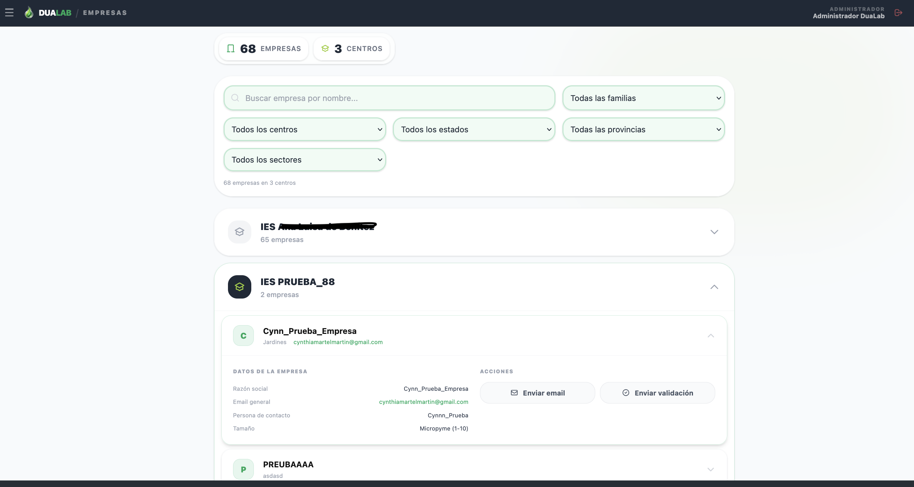

### Base de datos / catálogo BOE
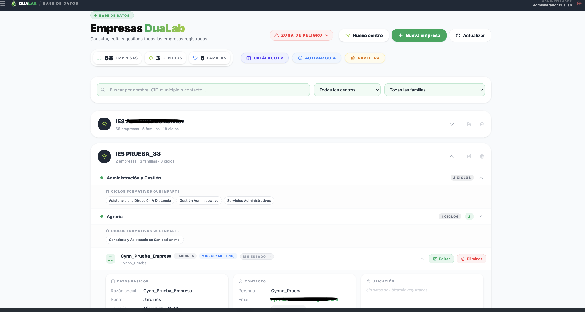

### Panel de administración usuarios
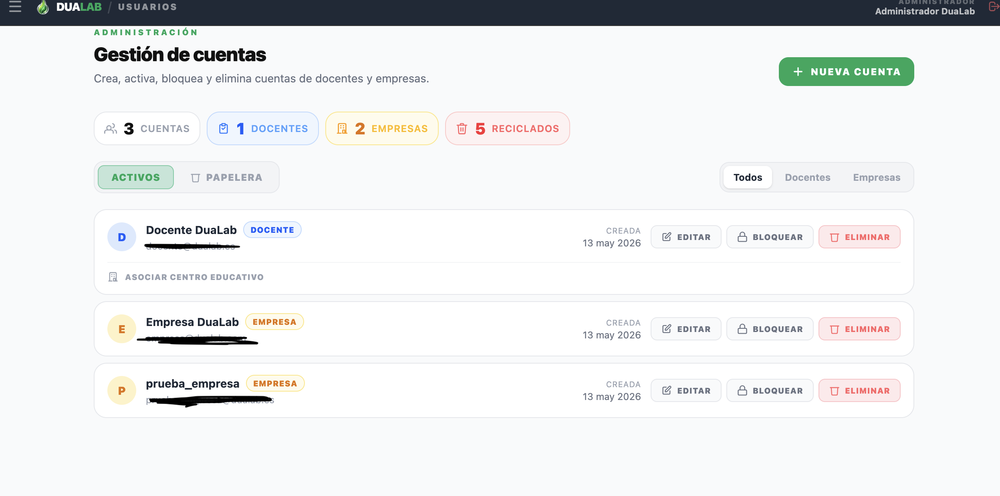

### Papelera
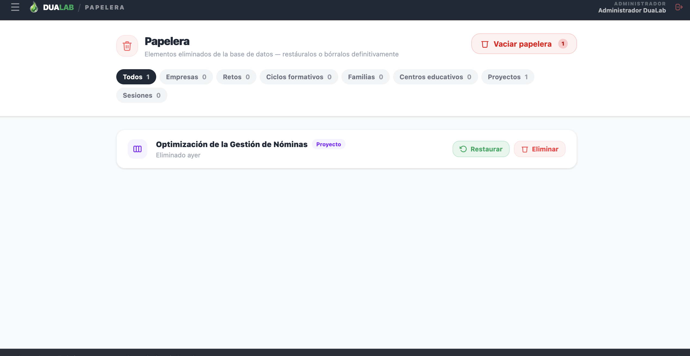

### Vista pública QR
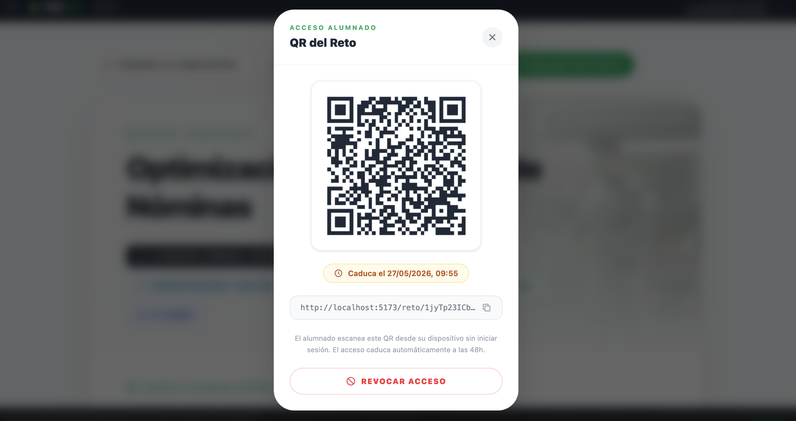

### TopBar y SidePanel
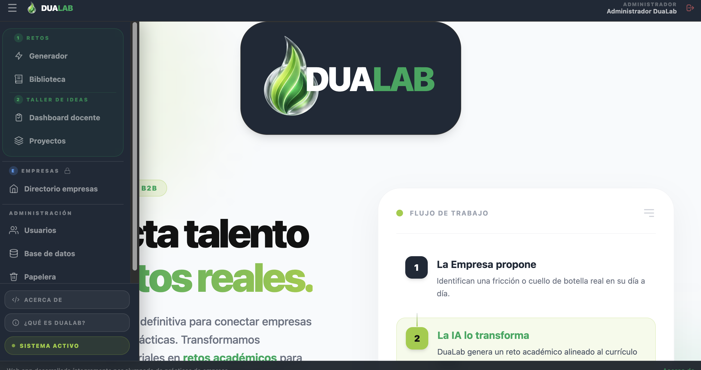

### Modal de creación / edición
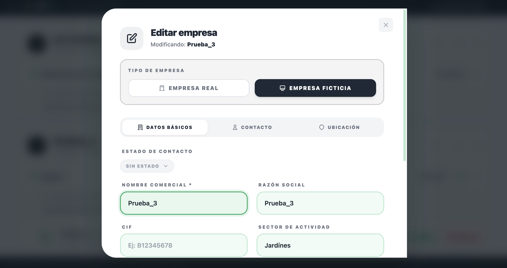

---

## Contexto del proyecto

Este proyecto fue desarrollado durante las **prácticas de 2º de DAM** (Desarrollo de Aplicaciones Multiplataforma) para **DuaLab**, una propuesta de innovación educativa.

Partimos de cero: sin base de código previa, sin documentación de requisitos formal. La metodología fue iterativa y real — reuniones con el equipo, decisiones de diseño compartidas, cambios de criterio a mitad del camino y entregables funcionales.

El resultado es una aplicación fullstack en producción, desplegada y para el uso docente, con retos para su alumnado en un contexto realista a partir de las necesidades de las empresas

---

## Objetivos

### Objetivo general

Crear una herramienta que facilite la colaboración entre centros FP y empresas a través de retos pedagógicos concretos, reduciendo la fricción burocrática y centralizando la gestión.

### Objetivos específicos

- Diseñar un sistema de roles con accesos diferenciados (admin, docente, empresa)
- Integrar IA para asistir en la creación de contenido pedagógico
- Implementar un CRM ligero para gestión del contacto con empresas
- Permitir el acceso público a retos mediante tokens/QR sin necesidad de login
- Garantizar integridad y recuperabilidad de los datos (soft deletes, papelera)
- Desplegar la aplicación en un entorno real accesible desde producción

---

## Stack tecnológico

### Backend

| Tecnología | Versión | Uso |
|---|---|---|
| Laravel | 12.0 | Framework principal, API REST |
| Laravel Sanctum | 4.0 | Autenticación por tokens |
| MySQL | 8.4 | Base de datos relacional |
| Eloquent ORM | — | Modelos, relaciones, soft deletes |
| OpenAI API | — | Generación asistida de contenido |
| Cloudinary | — | Almacenamiento de imágenes y recursos |
| PHP | 8.2+ | Lenguaje de servidor |

### Frontend

| Tecnología | Versión | Uso |
|---|---|---|
| Vue 3 | 3.5 | Framework frontend (Composition API) |
| Vite | 7.x | Build tool y dev server |
| Tailwind CSS | 4.2 | Estilos utilitarios |
| Pinia | 3.0 | Gestión de estado global |
| Vue Router | 4.6 | Enrutamiento SPA con guards |
| Axios | 1.13 | Cliente HTTP con interceptores |
| jsPDF | 4.2 | Generación de documentos PDF |
| QRCode.js | 1.5 | Generación de códigos QR |

### Infraestructura

| Herramienta | Uso |
|---|---|
| Docker / Laravel Sail | Entorno de desarrollo local |
| Hostinger | Despliegue en producción |
| Mailpit | Servidor SMTP local para testing |

---

## Arquitectura

El proyecto sigue una arquitectura **desacoplada**: backend API REST (Laravel) + frontend SPA (Vue 3). La comunicación se realiza exclusivamente mediante peticiones HTTP autenticadas con tokens Sanctum.

```
┌─────────────────────────┐        ┌──────────────────────────────┐
│     FRONTEND (Vue 3)    │        │       BACKEND (Laravel)      │
│                         │        │                              │
│  Vue Router  →  Vistas  │◄──────►│  API REST (~200 endpoints)   │
│  Pinia Store            │  HTTP  │  Controllers → Models        │
│  Axios Client           │  JSON  │  Sanctum Auth                │
│  Tailwind CSS           │        │  Eloquent ORM                │
└─────────────────────────┘        └──────────┬───────────────────┘
                                              │
                              ┌───────────────┼───────────────┐
                              │               │               │
                         ┌────▼────┐   ┌─────▼─────┐  ┌─────▼──────┐
                         │  MySQL  │   │  OpenAI   │  │ Cloudinary │
                         │   8.4   │   │    API    │  │  Storage   │
                         └─────────┘   └───────────┘  └────────────┘
```

**Modelo de roles:**

| Rol | Acceso |
|---|---|
| Admin | Acceso total: usuarios, BD, empresas, todos los retos y proyectos |
| Docente | Gestión propia: retos, sesiones y proyectos vinculados a su centro |
| Empresa | Visualización de biblioteca y validación de proyectos asignados |

---

## Flujo de la aplicación

### 1. Creación de un reto

```
Admin / Docente
      │
      ▼
Generador de Retos
      │
      ├─► Rellenar datos manualmente
      │         (empresa, ciclo, pregunta reto, competencias...)
      │
      └─► Asistente IA
                │
                ▼
        Sugerencia de contenido generada
                │
                ▼
        Revisión y publicación
                │
                ▼
        Disponible en Biblioteca
                │
                └─► Token QR público para alumnado
```

### 2. Ciclo completo de un proyecto (Taller de Ideas)

```
Dashboard Docente
      │
      ├─► Registrar sesión (fecha, centro, ciclo, reto, nº alumnos)
      │
      └─► Acceder al wizard desde la sesión
                │
                ▼
      Wizard de creación (8 pasos)
                │
                ├─ 1. Datos básicos (sesión, título, ciclo)
                ├─ 2. Datos de la empresa
                ├─ 3. Centro y equipo de alumnos
                ├─ 4. Módulos y currículum (RA/CE del BOE)
                ├─ 5. El reto (pregunta "¿Cómo podríamos…?")
                ├─ 6. Diseño del proyecto (fases, cronograma)
                ├─ 7. Objetivos y KPIs
                └─ 8. Publicar y adjuntar recursos
                │
                ▼
      Proyecto en estado "Propuesta"
                │
                ▼
      Token único enviado a empresa por email
                │
                ▼
      Empresa valida el proyecto (landing pública sin login)
                │
                ▼
      Estado: Validado ✓ / Rechazado ✗
```

### 3. Gestión de empresas (CRM)

```
Alta de empresa ──► Asignación a familias profesionales
      │
      ▼
Registro de contacto (estado, fecha cita, fricción)
      │
      ▼
Vinculación con retos y proyectos
      │
      ▼
Dashboard con estadísticas de colaboración
```

---

## Funcionalidades principales

### Generador de Retos con IA

Formulario asistido que permite a docentes y admins crear retos pedagógicos. Incluye integración con OpenAI para sugerir contenido: descripción de la empresa, el problema, el contexto del reto y los criterios de evaluación alineados con el catálogo del BOE.


---

### Biblioteca de Retos

Catálogo centralizado con filtros por familia profesional, ciclo formativo, módulo, nivel de dificultad y empresa. Permite previsualizar el reto y acceder al detalle completo.


---

### Dashboard Docente y sesiones

El Dashboard Docente es el punto de partida del trabajo diario del docente. Desde aquí registra las **sesiones** en las que ha trabajado un reto con un grupo: fecha, centro, ciclo formativo y número de alumnos. Cada sesión queda vinculada a un reto concreto de la biblioteca, lo que permite llevar un seguimiento real de cuántas veces se ha puesto en práctica cada reto, con qué grupos y en qué contexto.

Es también desde el dashboard desde donde se inicia la creación de un proyecto asociado a una sesión.


---

### Taller de Ideas — Wizard de proyecto

Formulario de creación de proyectos dividido en **8 pasos guiados**, pensado para que el docente complete toda la documentación del proyecto de forma progresiva y sin perder el hilo. Cada paso tiene una guía contextual que explica qué rellenar y por qué.

Los pasos cubren: datos básicos de la sesión, ficha de la empresa, composición del equipo de alumnos, módulos y currículum oficial (RA/CE del BOE), definición del reto y la pregunta "¿Cómo podríamos…?", planificación por fases y cronograma, objetivos de aprendizaje y KPIs, y publicación con adjuntos para la empresa.

Al publicar, se genera un **token único** que se envía a la empresa para que valide el proyecto desde una landing pública sin necesidad de cuenta.


---

### CRM de Empresas

Panel de gestión de empresas colaboradoras con datos de contacto, seguimiento del estado de la relación, vinculación con familias profesionales y métricas de participación.


---

### Base de datos académica (BOE)

Catálogo normalizado de familias profesionales, ciclos formativos, módulos y resultados de aprendizaje con criterios de evaluación, extraídos del Boletín Oficial del Estado.


---

### Acceso público por QR

Cada reto puede generar un token/QR que permite a los alumnos acceder al reto sin necesidad de cuenta. Diseñado para proyectarse en clase o compartirse por el aula.


---

### Sistema de papelera y soft deletes

Todos los elementos eliminados pasan por una papelera con opción de restauración. Ningún dato se borra definitivamente salvo confirmación explícita del administrador.


---

### Gestión de usuarios — alta controlada por administrador

La plataforma no tiene registro público. **Solo el administrador puede crear cuentas**, tanto de rol docente como de empresa. Esta decisión no es arbitraria: responde a un requisito de seguridad deliberado.

Al tratarse de una plataforma con datos académicos reales (centros, ciclos, alumnado, empresas colaboradoras), permitir el autoregistro abriría la puerta a que cualquier persona externa accediera a información sensible o pudiera interactuar con el sistema sin verificación previa. En su lugar, el flujo es:

1. El administrador crea la cuenta desde el panel de gestión de usuarios
2. Asigna el rol correspondiente (docente o empresa) y el centro educativo asociado si aplica
3. El usuario recibe sus credenciales y accede por primera vez

Esto garantiza que cada cuenta tiene una persona física verificada detrás, con un rol y un contexto concreto. Los docentes solo ven los datos de su propio centro; las empresas solo acceden a la biblioteca y a los proyectos en los que están involucradas.

El panel de administración incluye además la posibilidad de bloquear cuentas, gestionar usuarios en papelera y restablecer contraseñas, todo sin exponer la gestión de identidad a los propios usuarios.


---

## Diseño UX/UI

El diseño parte de una premisa funcional: la plataforma la usan docentes con tiempo limitado, en contextos de clase. Las decisiones de diseño priorizan la claridad sobre la estética.

### Principios aplicados

- **Progresividad**: Los formularios complejos se dividen en pasos (wizard) para no abrumar
- **Jerarquía visual clara**: Tipografía y espaciado consistentes con Tailwind; acciones primarias siempre visibles
- **Roles visibles**: El menú y las acciones disponibles cambian según el rol; el usuario siempre sabe dónde está
- **Feedback inmediato**: Toasts, estados de carga, confirmaciones antes de acciones destructivas
- **Acceso sin fricción**: Rutas públicas para alumnado y empresas sin necesidad de cuenta

### Decisiones de diseño

- Tema oscuro en side panel y top bar principal, tema claro en modales y formularios
- Componentes modales reutilizables para todas las entidades (crear, editar, eliminar)
- TopBar fija con logo y navegación por roles
- SidePanel colapsable con navegación principal


---

## Proceso de implementación

### Fase 1 — Modelado de datos y API

El primer bloque fue diseñar el esquema de base de datos. 36 migraciones que cubren desde entidades simples (familias, ciclos) hasta estructuras complejas con relaciones N:M y polimorfismo (tokens, recursos de proyectos).

Paralelamente, se construyó la API REST con Laravel: controladores, rutas protegidas por Sanctum, middleware de roles y throttling por endpoint según criticidad.

### Fase 2 — Autenticación y roles

Implementación del sistema de autenticación con tres niveles de acceso. Guards por rol en el frontend (Vue Router) y en el backend (middleware custom). Tokens con caducidad y límite de sesiones concurrentes.

### Fase 3 — Módulos principales

Desarrollo iterativo de los módulos en orden de prioridad funcional:

1. Generador de Retos
2. Biblioteca con filtros
3. Gestión de empresas (CRM)
4. Base de datos académica
5. Startup Day (Wizard + validación empresa)
6. Panel de administración de usuarios

### Fase 4 — Integración IA y servicios externos

Conexión con OpenAI para generación asistida, Cloudinary para almacenamiento de recursos y configuración del sistema de email transaccional.

### Fase 5 — Seguridad y datos

- Migración a UUIDs en retos para prevenir IDOR con IDs secuenciales expuestos
- Normalización de tablas (`empresa_familia`, `centro_ciclo`)
- Backfill de datos históricos tras cambios en esquema
- Soft deletes en todas las entidades principales
- Verificación de contraseña para operaciones sensibles en BD

### Fase 6 — Despliegue

Configuración del entorno de producción en Hostinger, gestión de variables de entorno, ajuste de CORS y pruebas de integración completa en producción.

---

## Lo que aprendí

Este proyecto fue una de mis primeras experiencias construyendo una aplicación real de esta escala. Algunos aprendizajes concretos:

**Backend y base de datos**
- Diseño de esquemas relacionales normalizados y su evolución mediante migraciones sin perder datos
- Autenticación stateless con tokens (frente a sesiones) y sus implicaciones prácticas
- Soft deletes como patrón de integridad referencial
- Throttling y seguridad en APIs públicas vs protegidas

**Frontend**
- Composition API de Vue 3 y el patrón composable para lógica reutilizable
- Gestión de estado global con Pinia y persistencia en localStorage
- Guards de navegación por rol en Vue Router
- Wizard multi-paso con validación incremental

**Arquitectura y proceso**
- Desacoplar completamente frontend y backend desde el principio facilita escalar ambos por separado
- Los cambios de requisitos a mitad del proyecto son normales; lo importante es que el esquema aguante sin destruir datos
- La seguridad no es una capa que se añade al final — hay que tenerla en cuenta desde el diseño

**Trabajo en equipo y contexto real**
- Comunicar decisiones técnicas a personas no técnicas
- Priorizar funcionalidades bajo tiempo real
- Documentar mientras se desarrolla, no después

---

## Sobre el proyecto

Prácticas 2º DAM · DuaLab · Curso 2024–2025

---

_Este proyecto fue construido con propósito educativo y está desplegado en un entorno real de uso._
